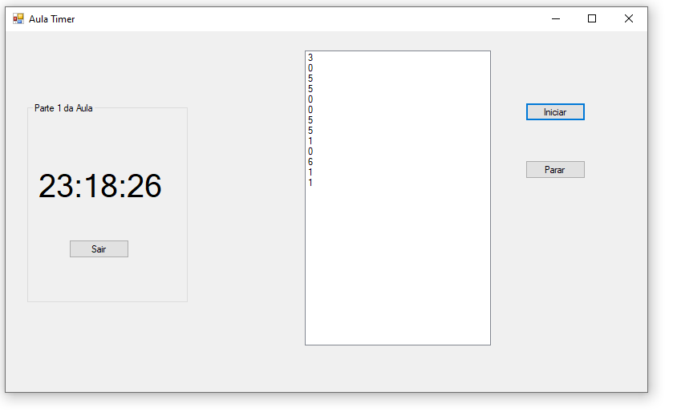

# aulaTimer-CSharp
aprendendo a usar o timer na aula de c# usando o Visual Studio. Aula na Etec de Guarulhos.
  

  <h3>Um elemento mostra a hora que o sistema mostra e no outro números aleatórios entre uns certos números aparecem a cada segundo</h3>
  

